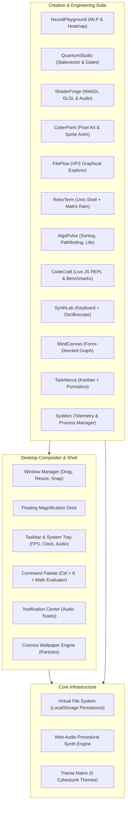

# 🌌 AETHER OS — Futuristic Cyberpunk Web Workstation

```text
   █████╗ ███████╗████████╗██╗  ██╗███████╗██████╗     OS: AetherOS Quantum v2.5
  ██╔══██╗██╔════╝╚══██╔══╝██║  ██║██╔════╝██╔══██╗    Kernel: WebAssembly 64-bit
  ███████║█████╗     ██║   ███████║█████╗  ██████╔╝    Compositor: Glassmorphism Multi-Window
  ██╔══██║██╔══╝     ██║   ██╔══██║██╔══╝  ██╔══██╗    Audio: Procedural Web Audio Synth
  ██║  ██║███████╗   ██║   ██║  ██║███████╗██║  ██║    Status: Production Ready • 42 Commits
  ╚═╝  ╚═╝╚══════╝   ╚═╝   ╚═╝  ╚═╝╚══════╝╚═╝  ╚═╝    Tests: 59/59 Passing (100%)
```

> **AetherOS** is an ultra-fast, modular cyberpunk desktop environment and developer workstation engineered with **React 19, TypeScript, and Vite**. It combines high-performance multi-window compositing, a persistent Virtual File System, procedural audio synthesis, deep learning neural networks, quantum computing simulation, and WebGL raymarching shaders.

---

## ⚡ Key Highlights & Architecture



---

## 🚀 The 12 Built-In Power Applications

| Application | Description |
| :--- | :--- |
| **🧠 NeuralPlayground** | Interactive deep learning sandbox with multi-layer perceptron (MLP), feedforward and backpropagation with matrix math, real-time 2D decision boundary heatmap, synaptic weight topology, and synthetic dataset generators (Spiral, XOR, Circle). |
| **⚛️ QuantumStudio** | Multi-qubit statevector quantum circuit simulator with Hadamard (H), Pauli (X, Y, Z), Phase (S), T, and CNOT entanglement gates. Features measurement probability histograms and Bell/GHZ presets. |
| **🔮 ShaderForge** | Real-time WebGL fragment shader visualizer with audio reactivity (`u_audio` FFT RMS), live GLSL compilation diagnostics, 60 FPS viewport, and presets (*Cyber Tunnel*, *Neon Grid Horizon*, *Cosmic Plasma*). |
| **🎨 CyberPaint** | 8-bit pixel art studio and sprite animator with flood fill (BFS), color dropper, customizable cyber palettes, multi-frame timeline, FPS loop playback, and PNG export. |
| **📁 FileFlow** | Graphical file manager for the Virtual File System featuring bookmark favorites, breadcrumb navigation, search filters, file inspector with in-place text/markdown editing, and file creation. |
| **📟 RetroTerm** | Authentic Unix terminal with command tokenizer, pipes (`\|`), grep filters, command history (`↑`/`↓`), tab autocomplete, `neofetch`, and fullscreen **Matrix digital rain**. |
| **⚡ AlgoPulse** | Algorithm studio featuring **Sorting Visualizer** (QuickSort, BubbleSort, InsertionSort with musical pitches), **Pathfinding Visualizer** (A* & Dijkstra with interactive wall drawing), and **Conway's Game of Life** with presets. |
| **💻 CodeCraft** | In-browser JavaScript code editor and execution sandbox with line numbers, console logger, execution duration benchmarks, and VFS file synchronization. |
| **🎹 SynthLab** | Polyphonic synthesizer with 2-octave piano keyboard, ADSR envelope shaping (Attack, Decay, Sustain, Release), oscillator waveforms (sawtooth, square, sine, triangle), and real-time FFT oscilloscope. |
| **🕸️ MindCanvas** | Force-directed physics knowledge graph on HTML5 canvas with dynamic Coulomb repulsion, Hooke spring attraction, velocity damping, node creation, and PNG export. |
| **📋 TaskNexus** | Kanban sprint board with drag-and-drop / column advancement, priority tags, integrated Pomodoro focus timer, and confetti milestones. |
| **📊 System Monitor** | Real-time CPU telemetry chart (moving-average SVG), RAM heap simulator, active window thread manager, and theme switcher. |

---

## 🎨 Theme Matrix

AetherOS includes 5 custom built-in cyberpunk and developer themes:
- **Cyberpunk Neon**: High-contrast cyan/magenta neon with CRT scanlines overlay.
- **Obsidian Minimal**: Sleek slate-dark palette with indigo accent lights.
- **Nord Frost**: Arctic pastel hues with glacier blue highlights.
- **Matrix Terminal**: Phosphor green monochromatic CRT terminal experience.
- **Solarized Dark**: Warm teal and amber balanced contrast theme.

---

## ⌨️ Master Keyboard Shortcuts

| Keybinding | Action |
| :--- | :--- |
| `Ctrl + K` / `Cmd + K` | Summon Global Spotlight Command Palette (with inline math solver) |
| `Double Click Titlebar` | Maximize / Restore Window |
| `◧` / `◨` Buttons | Snap Window Half-Screen Dock |
| `Tab` (in RetroTerm) | Autocomplete command names and file paths |
| `↑` / `↓` (in RetroTerm) | Traverse previous command history |
| `Q`, `W`, `E`, `R`, `T`... | Play piano keys in SynthLab |
| `matrix` (in RetroTerm) | Launch fullscreen Matrix digital glyph rain |
| `neofetch` (in RetroTerm) | Display ASCII art system telemetry |

---

## 🛠️ Development & Testing

### Quick Start
```bash
# Clone the repository
git clone https://github.com/Bhuwan077/aether-os.git
cd aether-os

# Install dependencies
npm install

# Launch development server
npm run dev
```

### Running Test Suite
```bash
# Run Vitest unit tests (59 tests covering VFS, WM, Terminal, Audio, Algorithms, Neural, Quantum, Math)
npm test
```

### Production Build
```bash
# Compile TypeScript and bundle with Vite
npm run build

# Preview production build
npm run preview
```

---

## 🧪 Test Coverage Summary (59 Unit Tests Passing)
- **Virtual File System**: CRUD, tree, path normalization, persistent storage
- **Window Manager**: Z-index stacking, edge snapping, maximization, bounds restoration
- **Terminal Engine**: Tokenization, quotes, pipe execution, command autocomplete
- **Audio Engine**: Procedural synthesis, volume clamping, mute toggling
- **Sorting Algorithms**: QuickSort, BubbleSort, InsertionSort correctness
- **Pathfinding Algorithms**: A* heuristic search, Dijkstra shortest path
- **Cellular Automaton**: Conway's Game of Life B3/S23 rules & presets
- **Neural Network**: Multi-layer forward pass, analytic activation gradients, backpropagation loss reduction
- **Neural Datasets**: Circle, Spiral, and XOR data point generators
- **Quantum Computing**: Complex number multiplication, Hadamard superposition, Pauli gates, Bell & GHZ state entanglement
- **Quantum Presets**: Monte Carlo probability distribution sampling
- **FileFlow Operations**: Directory listing, file editing, breadcrumbs
- **Pixel Art**: Cyberpunk palette verification and 4-way BFS flood fill
- **System Notifications**: Notification dispatch, priority routing, and auto-dismissal
- **Quick Calculator**: Inline arithmetic evaluation and operator precedence

---

## 📜 License
MIT License. Built for high-performance creative engineering.
